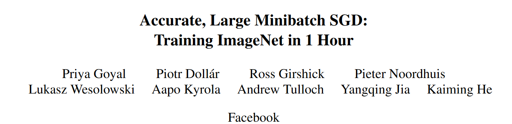
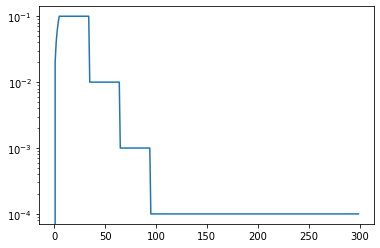

# tf2-lr-schedulers
 Modern LearningRateSchedulers in Tensorflow2


## Example
https://arxiv.org/abs/1706.02677



```python
from tf2_lr_schedulers import Goyal_LR
import matplotlib.pyplot as plt
x = np.array(range(300))
plt.plot(x, Goyal_LR(x, 1))
plt.yscale('log')
```

